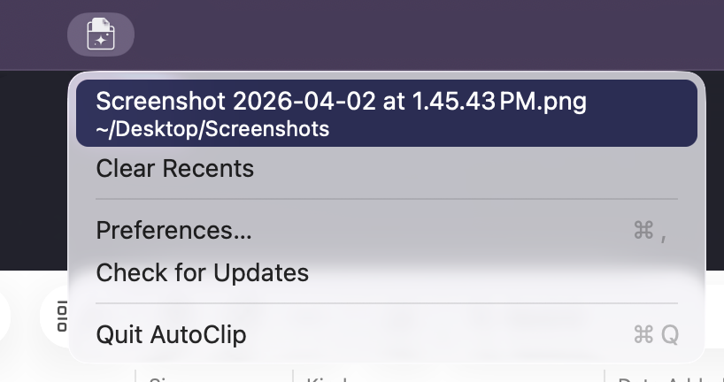

# AutoClip


**Screenshot/file → folder → clipboard → paste into app** but in one step!



A macOS menu bar app that watches folders for new files and automatically
copies them to the clipboard — the **file** (paste into Finder, Slack, AI
tools) and the **path** (`pbpaste` in terminal). Watches your screenshot
folder by default. Also great for Downloads.

## Why not Cmd+Ctrl+Shift+4?

That copies image data, not a file. AI tools like Claude Code need a file
path, and you lose the screenshot after pasting. With AutoClip, the
screenshot is saved to disk *and* on your clipboard — paste anywhere.

## Install

Download the latest `.zip` from
[Releases](https://github.com/jspiro/AutoClip/releases), unzip, move to
`/Applications/`, and open. Signed and notarized.

<details><summary>From source</summary>

```sh
git clone https://github.com/jspiro/AutoClip.git
cd AutoClip
make install
```
Requires Xcode Command Line Tools (`xcode-select --install`).
</details>

## Usage

Take a screenshot or add a file to a watched folder. AutoClip handles the rest:

- **Paste into Claude Code** — screenshot path is ready immediately
- **Cmd+V in Finder** — pastes a copy of the file
- **Cmd+V in Slack, Notes, etc.** — pastes the image
- **`pbpaste`** — returns the full path in terminal
- **Menu bar icon** — recent files, re-copy, preferences

## How it works

- Event-driven file watching via kqueue — zero CPU while idle
- Automatic updates via Sparkle
- No Dock icon, no Cmd+Tab — pure menu bar app

## Preferences

- **General** — watched folders, start at login, notifications, recent file count
- **File Types** — all files or specific extensions
- **About** — version, updates, contribute, report a bug

## Requirements

- macOS 13+

## License

[PolyForm Shield 1.0.0](LICENSE) — free to use, modify, and share;
no competitive use.
